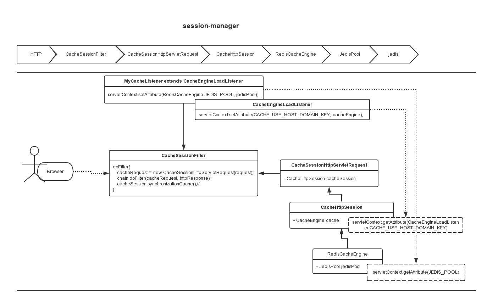

#session-manager

keywords: session manager; redis session manager; redis session;


# 1. config listener

   set JedisPool and cacheEngine, new customer CacheListener extends CacheEngineLoadListener:

CacheEngineLoadListener.java
````java
public class CacheListener extends CacheEngineLoadListener {
    private static Log log = LogFactory.getLog(CacheListener.class);
    protected WebApplicationContext ctx;

    @Override
    public void contextInitialized(ServletContextEvent event) {
        ServletContext servletContext = event.getServletContext();
        this.ctx = WebApplicationContextUtils.getWebApplicationContext(servletContext);//get spring ctx
        JedisPool jedisPool = this.ctx.getBean(JedisPool.class);//get jedisPool with spring
        log.info(jedisPool);
        servletContext.setAttribute(RedisCacheEngine.JEDIS_POOL, jedisPool);
        super.contextInitialized(event);
    }

    @Override
    public void contextDestroyed(ServletContextEvent event) {
        super.contextDestroyed(event);
    }
}
````

# 2. config web.xml (CacheListener & CacheSessionFilter)

|Parameter|Required|type|Default value|description|
|----|----|----|----|----|
|maxInactiveInterval | false | int | 28800 | session expired time in second |
|cookieDomain      | false | string | sub domain| set cookie domain |
|tldEnable         | false | boolean| false     | set cookie use top level domain |
|cookieSessionIdName | false | string | SESSIONID | session id name in cookie |
|cookieContextPath | false | string | /         | cookie context path |
|sessionCacheKeyPrefix     | false | string | session | session key prefix in redis |
|sessionAttributeListeners | false | string | null    | javax.servlet.http.HttpSessionListeners name, split with comma|

config web.xml
````xml
<listener>
    <listener-class>com.ezhe.www.listener.CacheListener</listener-class>
</listener>

<!-- session manager filter -->
<filter>
    <filter-name>CacheSessionFilter</filter-name>
    <filter-class>com.gozap.session.servlet.filter.session.CacheSessionFilter</filter-class>
    <init-param>
        <description>session expired time in second</description>
        <param-name>maxInactiveInterval</param-name>
        <param-value>3600</param-value>
    </init-param>
    <init-param>
        <description>session prefix int redis</description>
        <param-name>sessionCacheKeyPrefix</param-name>
        <param-value>session-ezhe</param-value>
    </init-param>
    <init-param>
        <description>use top level domain for sessionId </description>
        <param-name>tldEnable</param-name>
        <param-value>true</param-value>
    </init-param>
</filter>

<filter-mapping>
    <filter-name>CacheSessionFilter</filter-name>
    <url-pattern>/*</url-pattern>
</filter-mapping>

.... other filters

````

session-manager.png 


